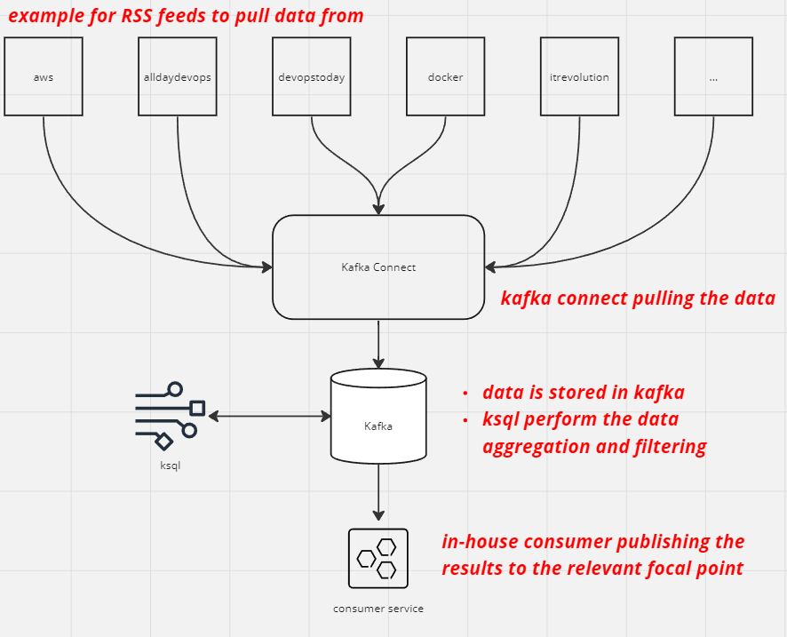

# top RSS DevOps feed
in order to stay up to date with the latest changes in the DevOps world we build a small system that tracks top RSS feeds and calculate the top feed to keep track of per 1 min/5 min/10 mins/30 mins using kafka connect and kstream and a python service that sends notifications about the feeds to different stackholders.

## Glossary
### [kafka](https://kafka.apache.org/)
Apache Kafka is an open-source distributed event streaming platform used by thousands of companies for high-performance data pipelines, streaming analytics, data integration, and mission-critical applications. It is designed to handle data streams from multiple sources and deliver them to multiple consumers.
### [Kafka Connect](https://docs.confluent.io/platform/current/connect/index.html)
Kafka Connect, an integral part of Apache Kafka, is an open-source component for building reusable data pipelines that move data into and out of Kafka. It provides scalable and resilient streaming of data between Apache Kafka and other data systems in a fault-tolerant manner.
### [ksql](https://ksqldb.io/)
KSQL (now known as ksqlDB) is an open-source streaming SQL engine for Apache Kafka. It provides an easy-to-use, yet powerful interactive SQL interface for stream processing on Kafka, without the need to write code in a programming language such as Java or Python. ksqlDB is scalable, elastic, fault-tolerant, and it supports a wide range of streaming operations, including data filtering, transformations, aggregations, joins, windowing, and sessionization.
### [Confluent for Kubernetes](https://docs.confluent.io/operator/current/overview.html)
Confluent for Kubernetes is a platform for managing and orchestrating Confluent Platform components, including Apache Kafka and Schema Registry, in a Kubernetes environment. It provides a Kubernetes-native experience to automate the deployment and key lifecycle operations like scaling, upgrades, and fault tolerance.

It simplifies the process of running Confluent Platform on Kubernetes, making it easier to deploy, scale, and manage Kafka clusters. It leverages Kubernetes concepts like Custom Resource Definitions (CRDs) and Operator patterns to provide this functionality.


## Description
the system is build is based on [kafka](https://kafka.apache.org/), [Kafka Connect](https://docs.confluent.io/platform/current/connect/index.html) and [ksql](https://ksqldb.io/) based on the Confluent Platform (deployed using [Confluent for Kubernetes](https://docs.confluent.io/operator/current/overview.html))

1. kafka connect is used to pull the data from the different RSS feeds using [RSS Source Connector](https://www.confluent.io/hub/kaliy/kafka-connect-rss?ref=rittmanmead.com) and store the data inside kafka.

2. ksql then:
2.1.  create a stream from the feeds topics
2.2. aggregate the streams into a single stream
2.3. filter events from this combined stream according to keyworks (kafka, kubernetes, redis, aws, gcp etc.) into a new stream
2.4. aggregate the topics according to different time frames

3. in-house consumer consuming the events and notify the relevent focal points



## Resources Location

| namespace | component | service type | User Name |
|--|--|--|--|
| application | application | clusterIP | - |
| confluent | kafka, kafka connect, ksql | **LoadBalancer** | - |
| prometheus | monitoring | clusterIP | - |
| grafana | monitoring | **LoadBalancer** | admin/admin |
| argocd | argocd | **LoadBalancer** | - |
| argo-workflows | argo-workflows | **LoadBalancer** | - |
| argo-workflows | argo-artifacts (minio) | clusterIP | admin/administrator |

** please note that **NOT** all resources are managed by argocd, CLI is usage required 

## Usage example
the platform is deployed using helm and managed using helm:

the connectors are deployed using the `kind: Connector` using:
```
{{- range $key, $value := .Values.feeds }}
apiVersion: platform.confluent.io/v1beta1
kind: Connector
metadata:
  name: {{ $key }}
  namespace: confluent
spec:
  class: "org.kaliy.kafka.connect.rss.RssSourceConnector"
  taskMax: 1
  connectClusterRef:
    name: connect
  configs:
    topic: {{ $key }}
    rss.urls: {{ $value }}
---
{{- end }}
```


example values file:
```
feeds:
  aws: "https://aws.amazon.com/blogs/devops/feed/"
  alldaydevops: "https://www.alldaydevops.com/blog/rss.xml"
  amazic: "https://world.amazic.com/feed/"
  atlassian: "https://www.atlassian.com/blog/devops/feed"
  devblogs: "https://devblogs.microsoft.com/devops/feed/"
  bmc: "https://www.bmc.com/blogs/categories/devops/feed"
  czerniga: "https://www.czerniga.it/pl/feed/"
  dbmaestro: "https://www3.dbmaestro.com/blog/rss.xml"
  devopsabcs: "https://blog.devopsabcs.com/index.php/feed/"
  devopsinstitute: "https://devopsinstitute.com/feed/"
  devopsonline: "http://www.devopsonline.co.uk/feed/"
  devopsradio: "https://devopsradio.libsyn.com/rss"
  devopstoday: "https://www.devopstoday.net/feed/"
  workatdevops: "https://workatdevops.blogspot.com/feeds/posts/default"
  devops: "https://devops.com/feed/"
  devopsgroup: "https://www.devopsgroup.com/feed/"
  docker: "https://www.docker.com/blog/feed/"
  dynatrace: "https://www.dynatrace.com/news/category/devops/feed/"
  itrevolution: "https://itrevolution.com/devops-blog/feed/"
  iheavy: "https://www.iheavy.com/feed/"
  infoq: "https://feed.infoq.com/Devops/articles/"
  invensislearning: "https://www.invensislearning.com/blog/devops/feed/"
  nsirap: "https://nsirap.com/feed/feed.xml"
  padok: "https://www.padok.fr/en/blog/rss.xml"
  testhouse: "https://www.testhouse.net/blogs-category/the-devops-blog/feed/"
```

the topics are created using the `kind: KafkaTopic` using:
```
{{- range $key, $value := .Values.feeds }}
apiVersion: platform.confluent.io/v1beta1
kind: KafkaTopic
metadata:
  name: {{ $key }}
  namespace: confluent
spec:
  replicas: 3
  partitionCount: 1
  retentionMinutes: 300
  kafkaClusterRef:
    name: kafka
    namespace: confluent
---
{{- end }}
```

